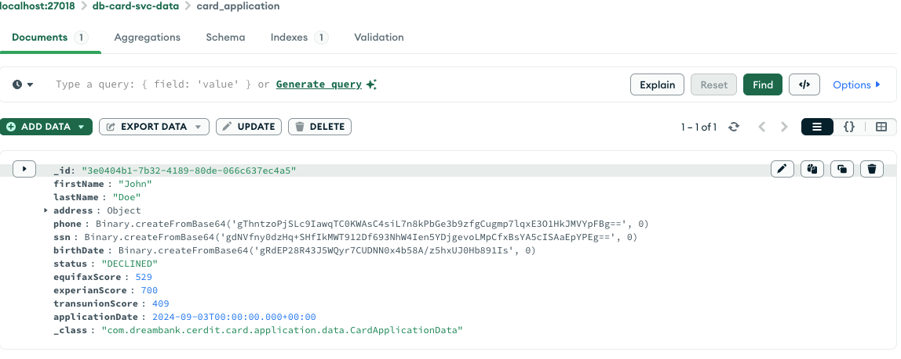
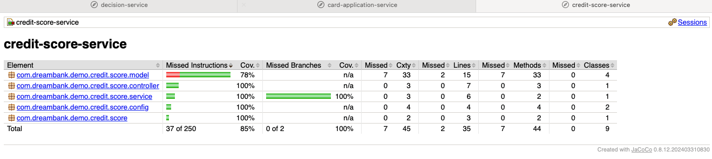

# Card Application Portal - Dream Bank 

## Component
1. Bank Config Server
2. Card Application Microservice
3. Decision Microservice
4. Equifax Credit Service
5. Experian Credit Service
6. Transunion Credit Service
7. Prometheus Service
8. Mongo DB (Card Application Document Store)

### Communication Diagram

### Creating a Docker Network
Command : 
>docker network create -d bridge dreambank-network

This network will be used while running all bank services. Same network will ease communication among services and mongodb.

### Setting Up Mongodb with Docker
__Step 1 :__ 
>docker pull mongo

__Step 2 :__ 
>docker run -d -p 27018:27017 --network dreambank-network --name dreambank-mongodb mongo;

__Step 3 :__
Cheking if Mongo Service is running and port forwarding working in docker
>docker ps

--Step 4:__
Cleaning up
> docker ps
> 
> docker rm -f CONTAINER ID
> 
> docker ps

### Project Setup

Git clone the repository at some directory and move to the root directory dreambank
https://github.com/jpanokha/dreambank.git

All Dockerfile are multistage docker, it will use gradle/maven to run build first to create Jar and then creates docker images of the jar.

### Bank Config Server  & Mongodb
This is a spring cloud based config server to hold configuration (properties) related to dreambank services.

__Tech Stack Used : Spring Cloud Config Server, docker, gradle,git.__

This service connects with another git repository(https://github.com/jpanokha/dreambank-config) to read configuration and keep it updated based on branch. any service can connect to this service and starts with latest configuration and can refresh all properties in refresh scope.

Docker Compose to this service includes spinning up mongodb just to minimize number of docker-compose and project setup. But this can be spun up as a separate container as described up and can be removed from compose file. 
As this service is pre-requisite for other services just like mongodb, starting will bring up mongodb database and config server.

__Command to run this service__

>docker compose -f ./bank-config-server/docker-compose.yml up --build -d

__Checking Config Server__
Config Server and Mongodb can be noticed in docker for mac/desktop as below

>curl --location 'http://localhost:7071/dreambank-config/decision-service/docker'

__Command to bring down both containers__

>docker compose -f ./bank-config-server/docker-compose.yml down

### Credit Score Service
This service contains setup for creating demo services for transunion, experian and equifax

This services spin up 3 containers and exposes reactive webflux endpoint to enable credit check. This simply looks into its store for credit data of user, if present it returns that, In case of failure it returns a random integer in the range 350-800 for ease of testing.

__Tech Stack Used : Spring Boot Webflux, docker, maven, JaCoCo, git.__

__Command to run this service__

>docker compose -f ./credit-score-service/docker-compose.yml up --build -d

__Command to bring down containers__

>docker compose -f ./credit-score-service/docker-compose.yml down

### Decision Service
This service is used to expose an endpoint to decide on a card application if it is approved/declined/pending based on credit scores received from credit-score-services.

It connects to spring cloud based config server to load its properties. This enables admin to update minimum credit rating. This will be done without restarting the container with a refresh endpoint exposed by actuator

__Tech Stack Used : Spring Boot Webflux, docker, gradle, JaCoCo, git, spring cloud config client.__

__Command to run this service__

>docker compose -f ./decision-service/docker-compose.yml up --build -d

__Checking Decision Service__

>curl --location 'http://localhost:8087/api/v1/decision/inquireCreditApproval' \
--header 'Content-Type: application/json' \
--data '{
"firstName" : "ABC",
"lastName" : "XYZ",
"ssn": "456-23-6780"
}'

__Refreshing Minimum Credit Rating__

>curl --location --request POST 'http://localhost:8087/manage/refresh' \
--data ''

__Command to bring down container__
>docker compose -f ./decision-service/docker-compose.yml down

### Card Application Service
This service is for exposing endpoints for Bank Card Application and Reporting

__Tech Stack Used : Spring Boot Webflux, docker, gradle, JaCoCo, git, spring cloud config client.__

_Command to run this service__

>docker compose -f ./card-application-service/docker-compose.yml up --build -d

__Checking Card Application API  Service__

>curl --location 'http://localhost:8080/api/v1/application/submit' \
--header 'Content-Type: application/json' \
--data '{"firstName" : "John",
    "lastName" : "Doe",
    "address" : {
        "addressLine1" : "5555 ABC  PKWY",
        "addressLine2" : "Apt #1788",
        "city" : "Phoenix",
        "zip" : "85050"
    },
    "phone" : "214-674-8245",
    "ssn" : "456-23-6784",
    "birthDate" :"1978-10-10" }'

Response : 
>{"name":"John Doe","status":"DECLINED","equifaxCreditScore":529,"experianCreditScore":700,"transUnionCreditScore":409}   

This API will call a decision service API to get decision and credit rating from credit score services and stores data in mongodb, and return decision response.

All sensitive data is encrypted before storing to mongodb.

__Checking Reporting Service APIs__

All Applications
>curl --location 'http://localhost:8080/api/v1/application/' \

Application Based on Status and Application Date
>curl --location 'http://localhost:8080/api/v1/application/report/DECLINED/2024-09-03'

__Command to bring down container__

>docker compose -f ./card-application-service/docker-compose.yml down

### Prometheus

Card Application Services metrics/health can be monitored at
http://localhost:9090/targets?search=

### Swagger UI
API Documentation will be available at
http://localhost:8080/webjars/swagger-ui/index.html

## Code Coverage

JaCoCo Plugin is used for measuring Java Code Coverage and consequently pass the build or fail it

>tasks.named('test') {
useJUnitPlatform()
finalizedBy jacocoTestReport
}

>tasks.named("jacocoTestCoverageVerification"){
violationRules {
rule {
limit {
counter = 'LINE'
value = 'COVEREDRATIO'
minimum = 0.8
}
}
}
}

>check.dependsOn jacocoTestCoverageVerification

It generates coverage report as follows

